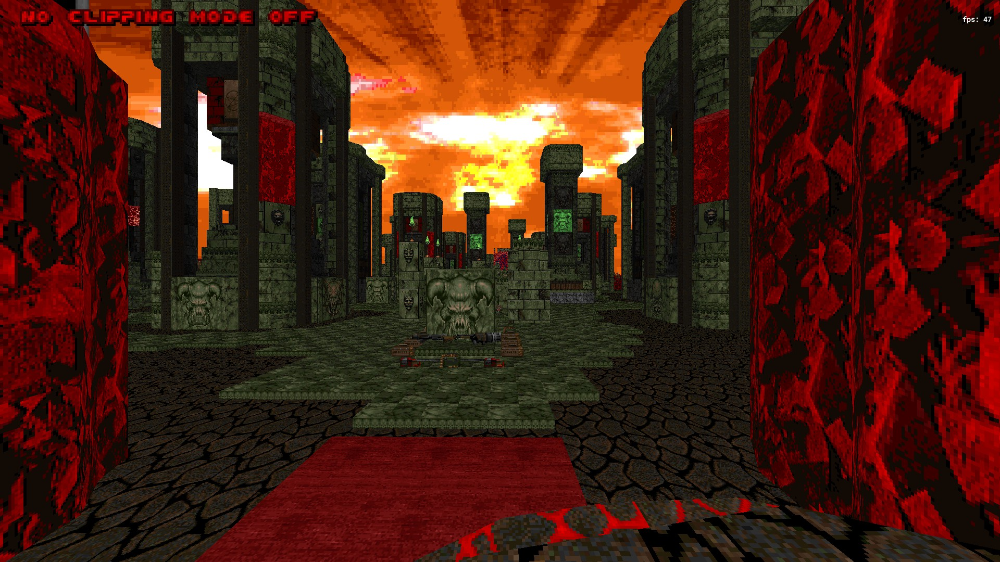
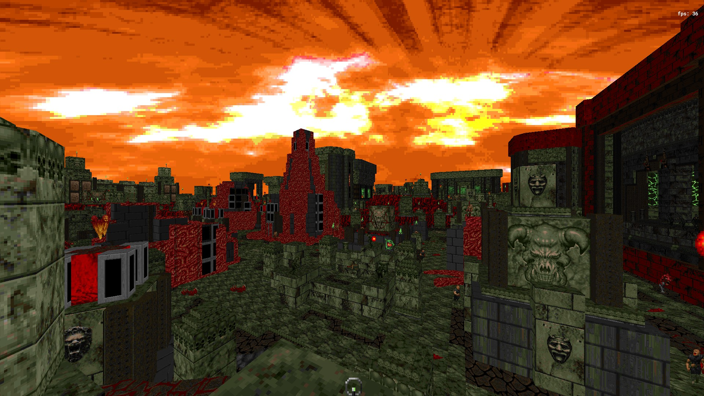
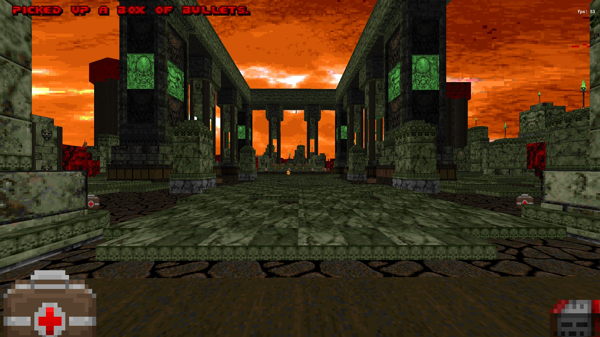
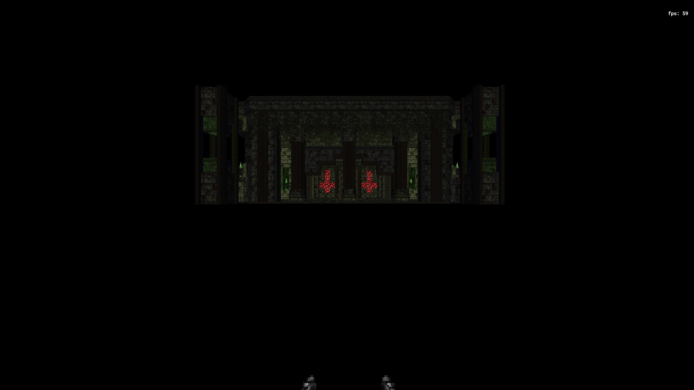

# The Last Day On Earth [1 Level, ID24 format, DOOM 2]
## 🏆 ENDOOM Mapping Contest 2025 Winner (5-th place) 🏆

# STATUS: ✅RELEASED
### Download - [Latest Release](https://github.com/Ear1h/WAD-The-Last-Day-On-Earth-EMC2025/releases/download/v1/The.Last.Day.on.Earth.zip)

The map was created in about 10 days for the ENDOOM Mapping Contest 2025, where it won, taking 5th place.

For detailed credit, see the CREDITS.TXT file.

This version is no different in gameplay and balance than the one in the contest archive with the exception of:

* Fixed Softlocks
* Fixed Switch slot 
* Fixed balance
* Add new monster count
* Rewrite dehacked

### Map description:
They are no longer with us, only you remain, the last man on Earth. You lost consciousness after learning that the last living and familiar voice stopped speaking through the radio. You are alone, and now you must decide the fate of the Earth yourself. Never give up, let all the spawn of Hell be afraid of you. The Path of Doom is already beginning.

A large slaughter map that tells the story of the last day of Earth, when all living creatures except you were exterminated. There is no longer any point in remaining on the doomed planet that cannot be saved.

### Map description
"They are no longer with us, only you remain, the last man on Earth"
You lost consciousness after learning that the last living and familiar voice
stopped speaking through the radio. You are alone, and now you must decide
the fate of the Earth yourself. Never give up, let all the spawn of Hell
be afraid of you.
The Path of Doom is already beginning.

A large slaughter map that tells the story of the last day of Earth,
when all living creatures except you were exterminated.
There is no longer any point in remaining on the doomed planet that
cannot be saved.

Your goal is to reach the main portal to Hell and destroy all
hellish creatures with the help of the "Apocalypse" - a powerful
weapon that is capable of destroying the Solar System in a moment.

Since humans managed to colonize the Solar System further than
Europe - a satellite of Jupiter, this weapon was left for the "doomed day".

You will have the most powerful weapon in the history of near-vanilla
levels, and face some serious enemies. Will you be able to defeat them
and continue the battle in Hell, or will you rot on the "doomed" Rarth,
being the last killed creature of the human race?

Commentary                      : BEFORE YOU START PLAYING, DO THE FOLLOWING:

CHECK THE LATEST GAME UPDATE

Installing the .wad file for KEX Doom:

Option 1:
1. Launch Doom + Doom II
2. Go to the Modifications tab
3. Click Play
4. In the local modifications section, find "Open modification folder"
5. Put the WAD into the DOOM folder itself, not in SAVES and not in bnetwads!!!
6. Restart the game

Option 2:
1. Find the root folder: User -> Saved Games -> Nightdive Studios -> Doom
2. Put the WAD into the Doom folder
3. Launch the game

Render: Vulkan, because the map is very demanding on Software and there
could be heavy lags.
There is a risk that the game will not launch on Vulkan, this is a port bug.

Setting the duration of messages (THIS IS EXTREMELY NECESSARY SO THAT YOU HAVE
TIME TO READ THE MESSAGES, SINCE THE LEVEL HAS LORE):
Settings -> Special features -> Message display duration -> Set to 7-8 seconds

The port is very unstable for an official port and there could be frequent
crashes back to the Main menu, the mod itself is stable and there were no crashes.
The goal of the map was to show the epicness of the battle due to the improved
Volcanic Eruption mod and what can now be done under the new ID24 standard.

Soundtrack by Damjan Mravunac.
List of the tracks:
Main Theme from SS4, Grand Cathedral Remix from SS4, Main theme from SS3,
Hero (vocal) from SS3, Freedom Too from SS: Siberian Mayhem, Hero Too from SS4.

I hope that I will make a huge contribution to the history of RU Doom Community
as the first mapper in the RU segment who fully applied the ID24 features.
List of features that I have implemented:

1. Music Changer through line intersection
2. Ammo system
3. Slot system. You can place 2 weapons on the 5th slot
4. Priority system. When you run on the 5th slot, you get the strongest available weapon
5. Message and sound system when picking up items
6. New icons in the Weapon carousel
7. Changing offsets and rotating flats (without duplicated versions of the same flats)
8. BossactionEdnum instead of Bossaction
9. Showing monsters cast after the end of the game (Legacy Of Rust-like with new monsters)
10. Wall textures are used on the floors, flats - on the walls

Additional links:

ENDOOM Mapping Contest 2025:
- Doom Power ([Contest itself](https://i.iddqd.ru/viewtopic.php?t=2720))
- Results with maps: Still Waiting

